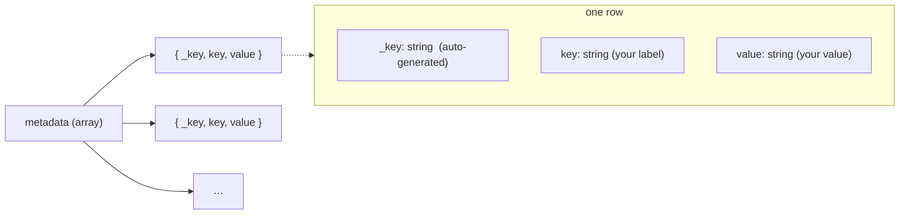

# sanity-key-value-input

[](https://www.npmjs.com/package/@liiift-studio/sanity-key-value-input)
[](#license)

Sanity Studio input component for editing ordered key-value string pairs. Supports add, remove, and reorder operations with real-time patch updates.

Use it in place of Sanity's default array-of-objects editor when you want a compact, spreadsheet-style row layout — both fields visible inline, with explicit up/down reordering — for metadata, attributes, or any ordered list of `key` → `value` strings.

## Preview

**Empty / initial state** — a single placeholder row with the Add Row button below.


**With entries** — once rows exist, the reorder rail appears on the left and a trash icon on the right of each row.


## Install

```bash
npm install @liiift-studio/sanity-key-value-input
```

## Usage

Use `KeyValueInput` as a custom `input` component on an array field. The array items must be `object`s with two `string` fields named exactly **`key`** and **`value`** — the component reads and writes those field names directly.

```typescript
import { defineType, defineField } from 'sanity'
import { KeyValueInput } from '@liiift-studio/sanity-key-value-input'

export const mySchema = defineType({
	name: 'myDocument',
	type: 'document',
	fields: [
		defineField({
			name: 'metadata',
			title: 'Metadata',
			type: 'array',
			of: [
				{
					type: 'object',
					fields: [
						{ name: 'key', type: 'string' },
						{ name: 'value', type: 'string' },
					],
				},
			],
			components: {
				input: KeyValueInput,
			},
		}),
	],
})
```

The component provides:
- Add new key-value pairs
- Remove existing pairs
- Reorder pairs up and down
- Inline editing of both key and value fields

## Data shape & querying

Each row is persisted as an object with an auto-generated `_key` plus the `key` and `value` strings. The component manages `_key` for you (you do not need to set it), so the stored field is an ordered array of:



A stored document field looks like:

```json
"metadata": [
	{ "_key": "a1b2c3d4e", "key": "Engineer", "value": "Name" },
	{ "_key": "f5g6h7i8j", "key": "Edition",  "value": "2024" }
]
```

Read the pairs back with GROQ — array order is preserved:

```groq
*[_type == "myDocument"]{
	"metadata": metadata[]{ key, value }
}
```

## Styling (optional)

The reorder and remove controls render as functional buttons out of the box. For finer visual control they expose styling hooks via the class names `manualButton`, `manualButtonUp`, `manualButtonDown`, and `manualButtonWrap`. The package does not ship CSS for these — add your own rules in the consuming Studio if you want to customise their appearance. Reorder and remove work whether or not you style them.

## Requirements

- Sanity Studio **v3+** (uses `set()` patches and the array field `components.input` API).
- The peer dependencies below, installed in the consuming Studio.

## Peer Dependencies

| Package | Version |
|---|---|
| `@sanity/icons` | `>=3` |
| `@sanity/ui` | `>=3` |
| `react` | `>=18` |
| `sanity` | `>=3` |

## License

[MIT](https://opensource.org/licenses/MIT) © Liiift Studio
