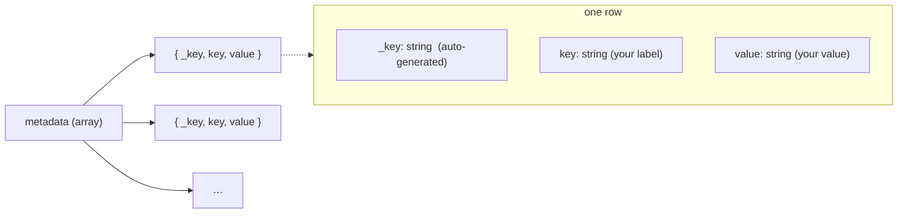

# sanity-key-value-input

[](https://www.npmjs.com/package/@overpunch/sanity-key-value-input)
[](#license)
[](#requirements)

Sanity Studio input component for editing ordered key-value string pairs. Supports add, remove, and reorder operations with real-time patch updates.

Use it in place of Sanity's default array-of-objects editor when you want a compact, spreadsheet-style row layout — both fields visible inline, with explicit up/down reordering — for metadata, attributes, or any ordered list of `key` → `value` strings.

## Preview

**Empty / initial state** — a single placeholder row with the Add Row button below.


**With entries** — once rows exist, the reorder rail appears on the left and a trash icon on the right of each row.


## Install

```bash
npm install @overpunch/sanity-key-value-input
```

## Usage

Use `KeyValueInput` as a custom `input` component on an array field. The array items must be `object`s with two `string` fields named exactly **`key`** and **`value`** — the component reads and writes those field names directly.

```typescript
import { defineType, defineField } from 'sanity'
import { KeyValueInput } from '@overpunch/sanity-key-value-input'

export const mySchema = defineType({
	name: 'myDocument',
	type: 'document',
	fields: [
		defineField({
			name: 'metadata',
			title: 'Metadata',
			type: 'array',
			of: [
				{
					type: 'object',
					fields: [
						{ name: 'key', type: 'string' },
						{ name: 'value', type: 'string' },
					],
				},
			],
			components: {
				input: KeyValueInput,
			},
		}),
	],
})
```

The component provides:
- Add new key-value pairs
- Remove existing pairs
- Reorder pairs up and down
- Inline editing of both key and value fields

## Data shape & querying

Each row is persisted as an object with an auto-generated `_key` plus the `key` and `value` strings. The component manages `_key` for you (you do not need to set it), so the stored field is an ordered array of:



A stored document field looks like:

```json
"metadata": [
	{ "_key": "a1b2c3d4e", "key": "Engineer", "value": "Name" },
	{ "_key": "f5g6h7i8j", "key": "Edition",  "value": "2024" }
]
```

Read the pairs back with GROQ — array order is preserved:

```groq
*[_type == "myDocument"]{
	"metadata": metadata[]{ key, value }
}
```

## Styling (optional)

The reorder and remove controls render as functional buttons out of the box. For finer visual control they expose styling hooks via the class names `manualButton`, `manualButtonUp`, `manualButtonDown`, and `manualButtonWrap`. The package does not ship CSS for these — add your own rules in the consuming Studio if you want to customise their appearance. Reorder and remove work whether or not you style them.

## Requirements

Supports **Sanity Studio v3, v4, v5 and v6** from a single build. It uses `set()` patches and the array field `components.input` API, and must render inside a Sanity Studio React tree.

The peer dependencies below must be present in the consuming Studio — they already are in any Studio install.

| Package | Supported range |
|---|---|
| `sanity` | `>=3 <7` (Studio v3 – v6) |
| `react` | `>=18` |
| `@sanity/ui` | `>=2 <5` |
| `@sanity/icons` | `>=2 <6` |

### How one build spans four majors

The peer ranges look inconsistent at a glance, so here is the reasoning:

- **`@sanity/ui` v4 moved components to subpath entries.** `Tooltip`, `Menu`, `MenuButton`, `MenuItem`, `Code`, `Popover`, `Autocomplete`, `Toast` and `useToast` are no longer on the package root.
- **`@sanity/icons` v5 removed every named `*Icon` export** — including `AddIcon`, `ArrowUpIcon`, `ArrowDownIcon` and `TrashIcon`, which this component's controls use.
- **Both still *declare* the removed names in their `.d.ts`, typed `never`.** A named import therefore type-checks, compiles, and only then fails at runtime — the breakage is invisible to `tsc` and to a green build.
- **So this package imports no `@sanity/ui` or `@sanity/icons` symbol directly.** Everything routes through [`@overpunch/sanity-ui-compat`](https://www.npmjs.com/package/@overpunch/sanity-ui-compat) (a real runtime dependency, installed for you), which resolves the installed namespace at runtime and works against either layout.

**The `@sanity/ui` peer is `>=2 <5`, and that is correct for Sanity v6** — Studio v6 ships `@sanity/ui` **v4**, not v5. It is not a stale upper bound.

### Verification status

v3 – v6 support is established by the declared peer ranges, green builds, and the runtime-resolving compat layer. Beyond that, this component has been exercised in **three in-house Studios**. It has **not** been broadly tested in a running Sanity 6 Studio outside those. Please [open an issue](https://github.com/Liiift-Studio/sanity-key-value-input/issues) if you hit a version-specific problem.

### Packaging

- Ships **ESM** (`dist/index.mjs`) and **CJS** (`dist/index.js`).
- The build sets `dts: false`, so **no bundled `.d.ts` type declarations are shipped.** TypeScript consumers will need their own module declaration, or can import from the published `src/` (exposed via the `source` export condition).

## License

[MIT](https://opensource.org/licenses/MIT) © Liiift Studio
