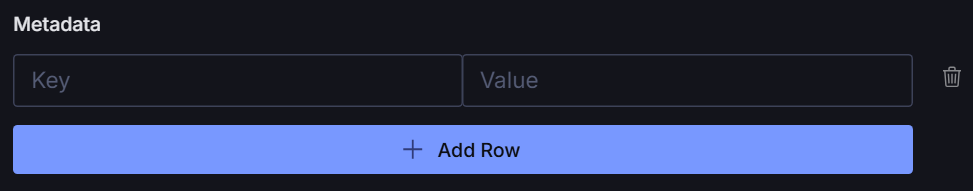
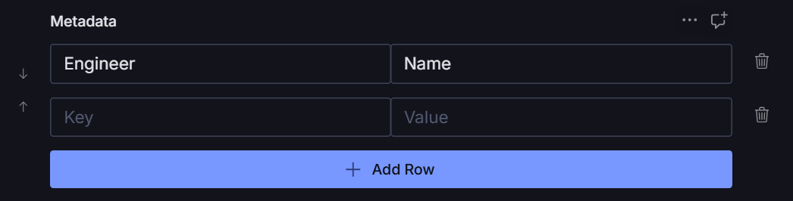

# sanity-key-value-input

[](https://www.npmjs.com/package/@liiift-studio/sanity-key-value-input)

Sanity Studio input component for editing ordered key-value string pairs. Supports add, remove, and reorder operations with real-time patch updates.

## Preview

**Empty / initial state** — a single placeholder row with the Add Row button below.



**With entries** — once rows exist, the reorder rail appears on the left and a trash icon on the right of each row.



## Install

```bash
npm install @liiift-studio/sanity-key-value-input
```

## Usage

Use `KeyValueInput` as a custom `input` component on an array field:

```typescript
import { KeyValueInput } from '@liiift-studio/sanity-key-value-input'

export const mySchema = defineType({
	name: 'myDocument',
	type: 'document',
	fields: [
		defineField({
			name: 'metadata',
			title: 'Metadata',
			type: 'array',
			of: [
				{
					type: 'object',
					fields: [
						{ name: 'key', type: 'string' },
						{ name: 'value', type: 'string' },
					],
				},
			],
			components: {
				input: KeyValueInput,
			},
		}),
	],
})
```

The component provides:
- Add new key-value pairs
- Remove existing pairs
- Reorder pairs up and down
- Inline editing of both key and value fields

## Peer Dependencies

| Package | Version |
|---|---|
| `@sanity/icons` | `>=3` |
| `@sanity/ui` | `>=3` |
| `react` | `>=18` |
| `sanity` | `>=3` |
